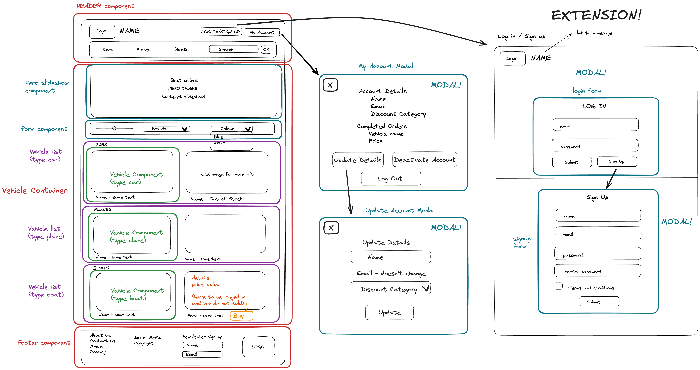

# Luxury Vehicle Shop Frontend Group Project

## Project Overview
Our project involved creating a React front-end application that provides an interface for one fo the server-side APIs developed by another backend group during our bootcamp.
By utilising many tools and features, we were able to design and create an interactive interface that showcases the functionality of our API with styling for better user experience.

## Diagrams
### Wireframe Diagram
The wireframe represents the skeleton of our website and showcases our initial planning, including possible features and extensions.

## Tech Stack
* IntelliJ IDEA (JDK 17)
* PostgresSQL
* Postico
* Postman
* Spring Boot
* React
* Visual Studio Code

Programming languages used:
* Java (server-side)
* Javascript --> React JS (client-side)
* HTML (client-side)
* CSS (client-side)

IntelliJ will need following dependencies to run the server-side application:
* Spring Data JPA
* Spring Boot DevTools
* Spring Web

## Setup Instructions
1. Ensure that the following are installed on your machine:
   * IntelliJ (JDK 17) - with Maven
   * PostgresSQL
   * Postman
   * Postico
   * Visual Studio Code
2. Fork the repository in GitHub, so you can make changes without affecting the original project. To fork the repository, click Fork in the top-right corner of the page. Fill out the details and then press Create fork.
3. Clone the forked repository from GitHub. To do this, at the top of forked repository page, click on the green < > Code button. Make sure that SSH is selected and then copy the link provided. Then within your terminal, in the working directory where you want the cloned directory, type the git clone command and paste the copied URL, then press Enter. It should look something like this:
    <pre><code> git clone git@github.com:{YOUR-USERNAME}/client_side_project.git </code></pre>
4. Create a new database by running the following line anywhere in your terminal: `createdb shop_db`
5. In your terminal (within the frontend_shop_project_client/src that should be opened in Visual Studio Code), perform the following command: `npm install` or `npm i` to install node modules.

### Run the application
1. Once you have installed all the necessary applications and dependencies for this project, run the BackendCodeApplication via Intellij IDEA. Ensure that there are no errors and that the API is running on port 8080.
2. In the Visual Studio Code terminal, perform the following command: `npm start`.  
    The App should automatically open in your browser. If it doesn't, you can manually navigate to `http://localhost:3000` using your preferred browser.

## Future Extensions
If we had additional time, we would have liked to add the following features to our project:
* Update functionality that would apply the customer's discount to the products they're buying
* Implement sliders for each vehicle category where we would showcase 3 vehicles at a time and rotate through the rest
* Create routes so that customers can navigate between pages (currently only 1 page)
* Attach some functionality to the Newsletter sign-up form in the footer
* Implement Order numbers to purchases made as well as stock numbers that should change in value upon completion of purchases.
* Separate the CSS editing for each modal so that the size of each could be adjusted according to the information in them. At the moment they are all large and the same size. Also can figure out how to blur the background behind the modals.
* Adding media responsiveness for use on different sized screens

## Collaborators
- GitHub: [William Dorling](https://github.com/williamdorling)
- GitHub: [Nasthasia Usoh](https://github.com/nasthasiausoh)
- GitHub: [Khalid Hussein](https://github.com/MKADH)
- GitHub: [Rada Kanchananupradit](https://github.com/R08K09)
