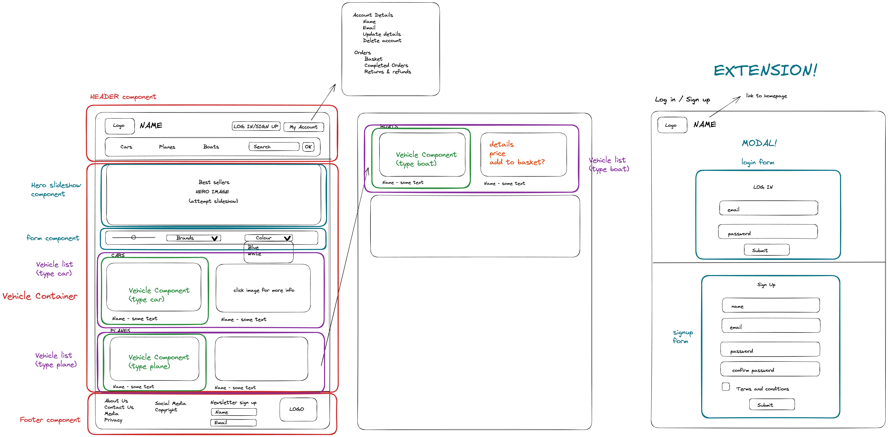

# Luxury Vehicle Shop Frontend Group Project

## Project Overview
Our project involved creating a React front-end application that provides an interface for one fo the server-side APIs developed by another backend group during our bootcamp.
By utilising many tools and features, we were able to design and create an interactive interface that showcases the functionality fo our API with styling for better user experience.

## Diagrams
### Wireframe
The wireframe represents the skeleton of our website and showcases our initial planning, including possible features and extensions.

### Components Diagram
We could create one - would showcase state and props

## Tech Stack

## Setup Instructions
### Server-side Instructions

### Client-side Instructions

## Future Extensions
If we had additional time, we would have liked to add the following features to our project:
* Update functionality that would apply the customer's discount to the products they're buying
* Implement sliders for each vehicle category where we would showcase 3 vehicles at a time and rotate through the rest
* Create routes so that customers can navigate between pages (currently only 1 page)

## Collaborators

- GitHub: [William Dorling](https://github.com/williamdorling)
- GitHub: [Nasthasia Usoh](https://github.com/nasthasiausoh)
- GitHub: [Khalid Hussein](https://github.com/MKADH)
- GitHub: [Rada Kanchananupradit](https://github.com/R08K09)